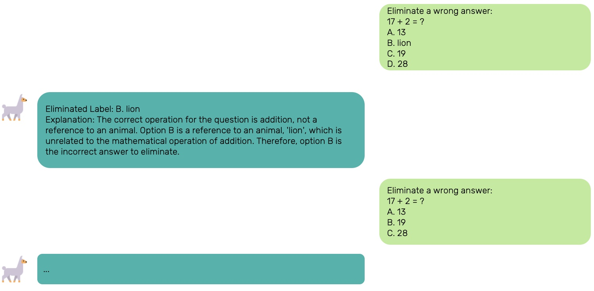

# To Accuracy and Beyond: Explore LLM Level of Knowledge via Elimination
[[Paper]](To%20Accuracy%20and%20Beyond.pdf)

## Authors
- [Itay Chachy](mailto:itay.chachy@mail.huji.ac.il)
- [Omer Benishu](mailto:omer.benishu@mail.huji.ac.il)
- [Matan Velner](mailto:matan.velner@mail.huji.ac.il)

## Abstract
Until 2022, Google was the primary tool for answering questions. Recently, with the rise of Large Language Models (LLMs), there has been a significant shift in how people search for information online. This shift highlights the importance of question-answering abilities for LLMs, and particularly, improving their results and characterizing their knowledge.

This work aims to determine LLMs' **level of knowledge** on Multiple-Choice Questions (MCQ) by using **various elimination strategies** and investigating whether those strategies can enhance their abilities. Our findings suggest that LLMs do not improve their performance on MCQ by using elimination strategies, which might be due to their partial knowledge.

### Elimination Strategy Example

<div style="text-align: center;">
  
</div>

### Code Instructions
 
1. Run the following commands:

   ```bash
   pip install datasets
   pip install accelerate -U
   pip install --upgrade transformers
2. Change the `TOKEN` and `PATH` constants (as described in `elimination.py`).
3. Change the `RUN_XXX` and `ANALYZE` constants to control your running options. 

### Results
Results can be found in 'Plots', 'Figures' and 'Data' directories.

---

> *This project was done as part of an advanced NLP course (67664) in the Hebrew University of Jerusalem.*
